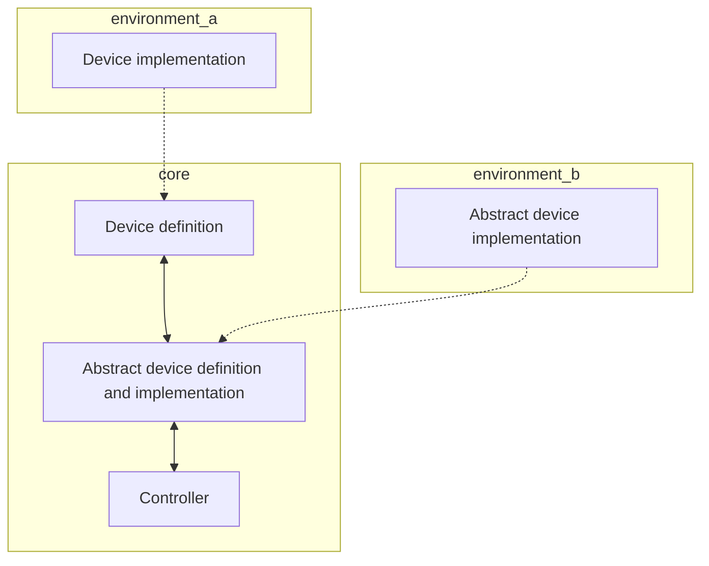
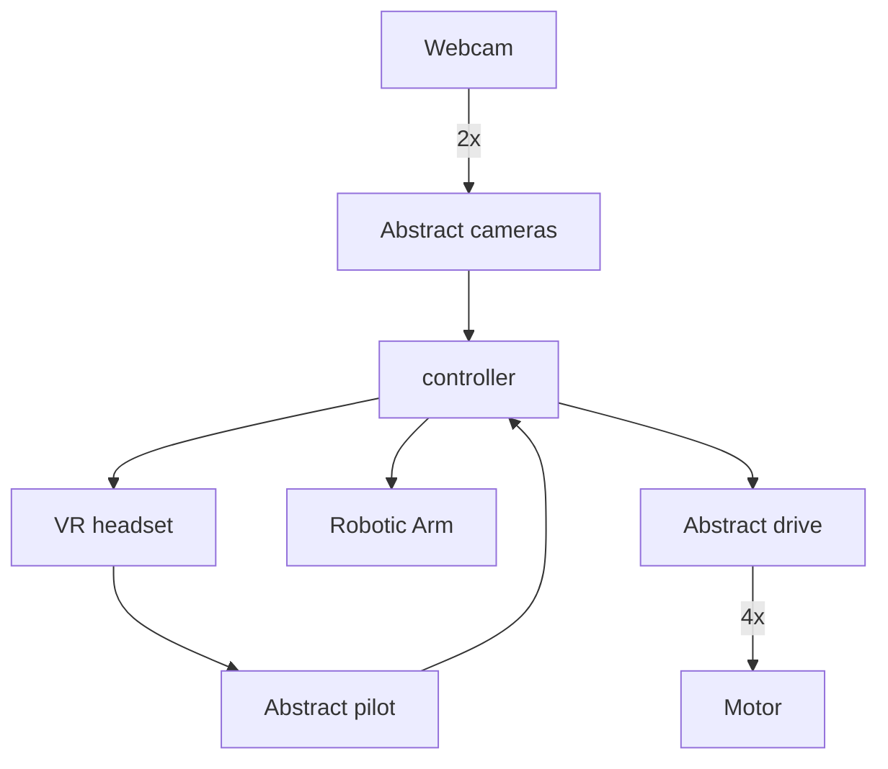

# Robotic Avatar Visionary Architecture

## Main building block.
The avatar controller talks to its environment using device definitions.

Some devices are abstract where both the definition and implementation is in the controller module. Abstract devises often model more high level concepts like position, locomotion, piloting. And is often implemented using one or more existing devices.

Environments are optional modules that can be enabled at build time and can implement one or more device or abstract devices.

Controller and environments are configured at startup.

## "Current" devices:

Devices for how Robotic Avatar works right now. But not implemented as devices.

## "Current" Environments

Current environments but not implemented as environments yet.

### ROS
Implements:
* Robotic Arm

### Arduino
Implements:
* Motor

### Web
Implements:
* VR headset
* Webcam

## Planned Environments

### Robot
Implements:
* Robotic Arm
* Motor
* Webcam

### Web
Implements:
* VR headset

## Unreal 
Implements:
* Robotic Arm
* Motor
* Webcam

## Mock
Implements:
* Robotic Arm
* Motor
* Webcam
* VR headset

